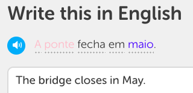
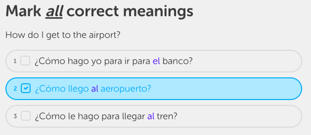

# gender-reveal
Color-codes words in [Duolingo](http://www.duolingo.com/) or [translate-jokes](https://github.com/jimdc/translate-jokes) by grammatical gender in target-to-source sentence challenges. Source information comes from hover hints and certain languages' gendered pronouns.

Recognition of words' genders in multiple choice exercises is under development.

# installation
You will need to have installed [Greasemonkey](https://addons.mozilla.org/en-US/firefox/addon/greasemonkey/) on Firefox or [Tampermonkey](https://chrome.google.com/webstore/detail/tampermonkey/dhdgffkkebhmkfjojejmpbldmpobfkfo?hl=en) on Chrome. Then go to [the userscript](gender-reveal.user.js) and click on "raw".

# color conventions
Currently follows the convention:
* "Blue" for "Masculine"
* "Pink" for "Feminine"
* "Green" for "Neuter"

# pronouns
Gendered pronouns, which do not have hints in Duolingo, are colored--*if the pronoun is unambiguous*--in French, Portuguese, Spanish, German and Dutch. This means that in German, only *er*, *ihn*, *ihrer*, and *es* are colored. *Der*, for example, cannot be colored, since it could be masculine in the *nominativ* case, or feminine in the *dativ* case. In the future, I hope to be able to analyze case to disambiguate those pronouns' gender. 

